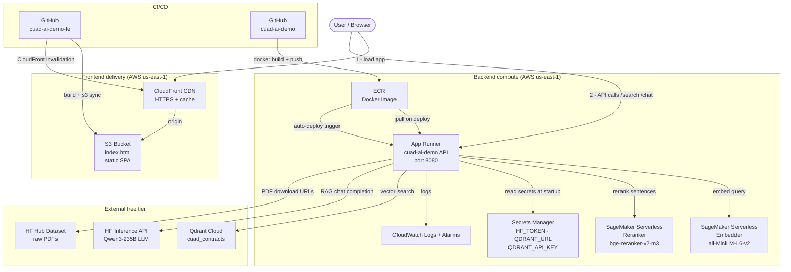

# AWS Deployment Plan — cuad-ai-demo

**Region**: us-east-1 (N. Virginia)  
**Model**: Serverless-first, warm-on-demand for demo days  
**Last updated**: 2026-06-10

---

## Architecture Overview



---

## Service Decisions

| Layer | Service | Justification |
|---|---|---|
| **Frontend hosting** | S3 + CloudFront | Vite builds to a single `index.html` (via `vite-plugin-singlefile`); no server needed. CloudFront provides HTTPS + caching. |
| **Backend compute** | App Runner (cold, scales to zero) | No ALB cost, built-in HTTPS, auto-deploy from ECR |
| **Embedder** | SageMaker Serverless (`all-MiniLM-L6-v2`) | Removes HF free-tier rate-limit risk for embeddings |
| **Reranker** | SageMaker Serverless (`bge-reranker-v2-m3`) | Same; us-east-1 keeps HF↔SageMaker latency at ~5ms |
| **LLM (chat)** | HF Inference API free (`Qwen3-235B`) | SageMaker Serverless can't fit 235B; HF free tier sufficient |
| **Vector DB** | Qdrant Cloud free tier | Already ingested; free tier covers demo corpus |
| **PDF storage** | HF Hub Dataset | Already there; no migration needed |
| **Secrets** | Secrets Manager | HF_TOKEN, QDRANT_URL, QDRANT_API_KEY |
| **Logs** | CloudWatch Logs | Included with App Runner |
| **Registry** | ECR | Required for App Runner |

---

## How the Frontend Works on AWS

The React app uses `vite-plugin-singlefile` — the entire app (JS + CSS + HTML) is bundled into **one `index.html`** at build time. This file is uploaded to S3 and served via CloudFront.

**Critical**: The backend API URLs (`VITE_SEARCH_API`, `VITE_DOCUMENTS_API`, `VITE_CHAT_API`, `VITE_CHAT_STREAM_API`) are **baked into the build** at `npm run build` time, not at runtime. The CI/CD pipeline must inject the App Runner service URL as a GitHub Actions secret before building.

```
# .env.production (injected at build time in CI)
VITE_SEARCH_API=https://<app-runner-id>.us-east-1.awsapprunner.com/search
VITE_DOCUMENTS_API=https://<app-runner-id>.us-east-1.awsapprunner.com/documents
VITE_CHAT_API=https://<app-runner-id>.us-east-1.awsapprunner.com/chat
VITE_CHAT_STREAM_API=https://<app-runner-id>.us-east-1.awsapprunner.com/chat/stream
```

**CORS**: App Runner's FastAPI already has `CORSMiddleware` with `allow_origins=["*"]`. This works, but the wildcard should be tightened to the CloudFront domain before any real user traffic ([app.py:281](../app.py#L281)):
```python
allow_origins=["https://<cloudfront-id>.cloudfront.net"]
```

---

## Normal Operation Costs (us-east-1, 10 users/day)

### Frontend
| Service | Monthly cost |
|---|---|
| S3 storage (~500 KB single file) | ~$0.00 |
| CloudFront (free tier: 1 TB + 10M requests/mo) | ~$0.00 |
| **Frontend subtotal** | **~$0** |

### Backend
| Service | Monthly cost |
|---|---|
| App Runner (cold, scales to zero) | ~$0.04 |
| SageMaker Serverless — Embedder | ~$0.001 |
| SageMaker Serverless — Reranker | ~$0.42 |
| Qdrant Cloud | $0 |
| HF Inference API (LLM) | $0 |
| ECR (~1.5 GB image) | ~$0.15 |
| Secrets Manager (3 secrets) | ~$1.20 |
| CloudWatch Logs | ~$0.25 |
| Data transfer out | ~$0.10 |
| **Backend subtotal** | **~$2–3** |

### **Total: ~$2–3 / month**

---

### Cold start behaviour (normal mode)

| Component | Cold start time | Trigger |
|---|---|---|
| App Runner container | 15–30s | First request after idle |
| SageMaker Embedder | 1–3s | First call after ~5 min idle |
| SageMaker Reranker | 3–8s | First call after ~5 min idle |
| CloudFront / S3 | None | Static file, always warm |

---

## Demo Day — Warm Everything Up

Run these steps the morning of a demo to eliminate all cold starts.  
**Total extra cost: ~$2.50 for a 24-hour warm window.**

### Step 1 — Warm App Runner (set min 1 provisioned instance)

```bash
# Create an auto-scaling config with minimum 1 instance
aws apprunner create-auto-scaling-configuration \
  --auto-scaling-configuration-name cuad-demo-warm \
  --min-size 1 \
  --max-size 3 \
  --max-concurrency 10 \
  --region us-east-1

# Apply to service (get SERVICE_ARN from console or list-services)
aws apprunner update-service \
  --service-arn <SERVICE_ARN> \
  --auto-scaling-configuration-arn <AUTOSCALING_CONFIG_ARN> \
  --region us-east-1
```

Apply time: ~2 min | Cost: **~$0.13/day**

---

### Step 2 — Warm Reranker (create real-time SageMaker endpoint)

Serverless → Real-time requires creating a new endpoint, then pointing App Runner at it via env var.

```bash
# Create endpoint config on ml.m5.large (fits bge-reranker-v2-m3 at 570 MB)
aws sagemaker create-endpoint-config \
  --endpoint-config-name reranker-warm-config \
  --production-variants '[{
    "VariantName": "default",
    "ModelName": "cuad-reranker",
    "InstanceType": "ml.m5.large",
    "InitialInstanceCount": 1
  }]' \
  --region us-east-1

# Spin up the endpoint (wait ~10 min for InService status)
aws sagemaker create-endpoint \
  --endpoint-name cuad-reranker-warm \
  --endpoint-config-name reranker-warm-config \
  --region us-east-1

aws sagemaker wait endpoint-in-service \
  --endpoint-name cuad-reranker-warm \
  --region us-east-1

# Point App Runner at the warm endpoint
aws apprunner update-service \
  --service-arn <SERVICE_ARN> \
  --source-configuration '{
    "ImageRepository": {
      "ImageConfiguration": {
        "RuntimeEnvironmentVariables": {
          "RERANKER_ENDPOINT": "cuad-reranker-warm"
        }
      }
    }
  }' \
  --region us-east-1
```

Apply time: ~10 min | Cost: **~$2.30/day** (ml.m5.large)

---

### Step 3 — After the demo, revert everything

```bash
# Revert App Runner to cold auto-scaling (min 0)
aws apprunner update-service \
  --service-arn <SERVICE_ARN> \
  --auto-scaling-configuration-arn <ORIGINAL_COLD_CONFIG_ARN> \
  --region us-east-1

# Revert reranker env var back to serverless endpoint
aws apprunner update-service \
  --service-arn <SERVICE_ARN> \
  --source-configuration '{
    "ImageRepository": {
      "ImageConfiguration": {
        "RuntimeEnvironmentVariables": {
          "RERANKER_ENDPOINT": "cuad-reranker-serverless"
        }
      }
    }
  }' \
  --region us-east-1

# Delete warm endpoint — billing stops immediately
aws sagemaker delete-endpoint \
  --endpoint-name cuad-reranker-warm \
  --region us-east-1

aws sagemaker delete-endpoint-config \
  --endpoint-config-name reranker-warm-config \
  --region us-east-1
```

Revert time: ~2 min

---

## Demo Day Cost Summary

| | Normal month | Demo day extra |
|---|---|---|
| App Runner warm | $0.04 | +$0.13 |
| Reranker real-time endpoint | $0.42 | +$2.30 |
| Frontend (S3 + CloudFront) | $0 | $0 |
| Everything else | ~$1.70 | no change |
| **Total** | **~$2–3/mo** | **+~$2.50** |

---

## Environment Variables

### App Runner (backend) — stored in Secrets Manager

| Secret name | Env var | Notes |
|---|---|---|
| `cuad/hf-token` | `HF_TOKEN` | HF Inference + Hub access |
| `cuad/qdrant-url` | `CLUSTER_URL` | Qdrant Cloud cluster URL |
| `cuad/qdrant-api-key` | `QDRANT_API_KEY` | Qdrant Cloud API key |

### App Runner (backend) — non-secret, set in service config

| Env var | Value |
|---|---|
| `QDRANT_COLLECTION` | `cuad_contracts` |
| `EMBED_MODEL` | `sentence-transformers/all-MiniLM-L6-v2` |
| `VECTOR_SIZE` | `384` |
| `EMBEDDER_ENDPOINT` | `cuad-embedder-serverless` |
| `RERANKER_ENDPOINT` | `cuad-reranker-serverless` |
| `CHAT_MODEL` | `Qwen/Qwen3-235B-A22B:novita` |
| `PORT` | `8080` |
| `ALLOWED_ORIGINS` | `https://<cloudfront-id>.cloudfront.net` (set after first deploy) |

### Frontend build (GitHub Actions secrets for cuad-ai-demo-fe repo)

| GitHub Secret | Injected as | Notes |
|---|---|---|
| `VITE_API_BASE_URL` | used to set all `VITE_*` vars | App Runner service URL, set after first deploy |

---

## CI/CD Overview

### Backend (this repo)
```
push to main
  → GitHub Actions
  → docker build
  → ECR push (us-east-1)
  → App Runner auto-deploys new image
```

### Frontend (cuad-ai-demo-fe repo)
```
push to main
  → GitHub Actions
  → npm run build  (VITE_* env vars injected from GitHub Secrets)
  → aws s3 sync dist/ s3://cuad-ai-demo-fe/
  → aws cloudfront create-invalidation (clears CDN cache)
```

---

## Architecture Decisions (resolved)

| Decision | Choice | Notes |
|---|---|---|
| CI/CD auth | GitHub Actions + OIDC | No long-lived AWS credentials stored in GitHub |
| App Runner size | 0.5 vCPU / 1 GB | Safer for Qdrant client init at cold start |
| SageMaker model packaging | Pull from HF Hub at endpoint creation | Simpler; acceptable cold start for demo |
| Reranker batching | ✅ Done — `_hf_ce_scores_batch` | See code changes below |
| CORS | ✅ Done — `ALLOWED_ORIGINS` env var | No wildcard; set CloudFront domain on deploy |

## Code Changes Made

### 1. Reranker batching ([qdrant_search_hf.py](../cuad-demo-quadrant/qdrant_search_hf.py))

Added `_hf_ce_scores_batch` which sends all `(query, passage)` pairs in a **single** HF Inference API call instead of N parallel calls. Both `highlight_text` (sentence scoring) and `_rerank_points` (result-list reranking) now use it.

- **Before**: N parallel HTTPS calls (up to 16 workers × 200 sentences = 200 round-trips)
- **After**: 1 batch HTTPS call per operation
- Reduces SageMaker Serverless invocation count from ~200/search to ~1 for highlighting + ~1 for result reranking

### 2. CORS ([app.py](../app.py))

Replaced hardcoded `allow_origins=["*"]` with `ALLOWED_ORIGINS` env var ([app.py:281](../app.py#L281)):
- Dev default: `localhost:5173`, `localhost:3000`, HF Spaces URL
- Production: set `ALLOWED_ORIGINS=https://<cloudfront-id>.cloudfront.net` in App Runner config
